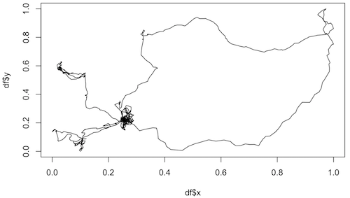

# Fake Life Recognition Contest 

## Introduction

This repository contains the data and data cleaning scripts used to run the competion at https://competitions.codalab.org/competitions/20612 , organized by Olaf Witkowski and Lana Sinapayen, with help from Kaan Akinci, Chitora Shindo, and 
Elhadji Amadou Oury Diallo. Logo and design from Lucy Kwok.

The final scoreboard for the 5 submissions that scored 7 points in the initial phase (correct answer: drone=0, seal=1)

Final winner: Team Christin (`winning_submission_hypothesis.pdf`)

Correct answers: see also `data/cheat_sheet.csv`

0,fake_ready/0  Boids  
1,fake_ready/1  Artificial Chemistry 
2,real_ready/2  Sharks  
3,fake_ready/3  Artificial Agent
4,real_ready/4  Jaguars
5,real_ready/0  Birds  
6,real_ready/1  Ants  
7,fake_ready/4  Robot Arm
8,fake_ready/2  Soft robot
9,real_ready/3  Spiders  

### INTRO 

The problem of identifying living systems from non-living one is a difficult question, which research fields such as artificial life or origins of life have been trying to address for decades or more. One can probably tell by sight that a walking line of ants is made of living things, while a flowing river is not. Can a computer tell apart living from non-living things as well as we can? The question is not settled in theory, but we had the idea of trying to settle it in practice.

We (Lana Sinapayen and Olaf Witkowski) are organizing a *Fake Life Recognition Contest* (supported by Cross Compass Ltd., and co-organized by Cross Labs and ELSI). The competition has just been announced at the ALIFE 2019 conference, in Newcastle, UK. Concretely, a list of unlabeled datasets are made available online. Some are time series of real living systems, and some are generated by non-living systems. Participants can test their algorithms on these public datasets, but their algorithms will be judged based on unreleased datasets. Along with a working algorithm, each participant is required to submit a description of the underlying theoretical measure (i.e. "What is your theory about to correctly classify these datasets? What is your idea based on?").

We intend this competition as a critical initiative to help Artificial Life research, and drive it in a practical way, just like computational linguistics for example made tremendous progress in the past few decades by setting up well-defined tasks as shared open challenges. Our goal is to contribute to scientific progress in the field. Although the impact on industry is not the main purpose, one may imagine numerous applications in terms of detection of living systems. The contributions from participants will hopefully help progress in refining our mathematical understanding of the nature of living systems, i.e. what life is in contrast to inert matter. This, in turn, is connected to problems of life detection on exoplanets, the detection of extremophiles on Earth, and the origin of life, and the study of synthetic living systems in general. We consider this as a very important yet not much funded research area, relating to fundamental questions about the status and uniqueness of human life and intelligence in the universe.

Concretely, the participants simply need to provide two major elements: a code in Python that returns 1 if the data is from a real living system, and 0 if it's not, and a very short PDF description of what's the mathematical measure under the hood. The use of learning algorithms is expressly not allowed, for the obvious reason they would not yield an explanation of why they work. In case of any doubt, please contact the organizers. Please refer to details under the 'participate' tab.

The datasets consist in time series of trajectory positions in 2D (those are meant as actual spatial trajectories), which correspond to either artificial or real living systems. Each dataset comes in the form of a 20Mb or so CSV file with 3 columns labelled “t“, “x” and “y”, with 10,000 rows. 

## Data

The repository contains a R notebook with the code used to clean the data, and the ID of the data files that were selected (`data_cleaning.Rmd`) as well as the corresponding html output (`data_cleaning.html`). Download the html and open it in your browser to see the graphs.
The scoring algorithm for the final phase is `data/final_phase_data/evaluation.ipynb`

The data in the `data` folder is divided into:

Raw data for artificial datasets and their descriptions (because of GitHub file limitations, the raw data for sharks is not included and should be downloaded from the link below); cleaned datasets, i.e. real_life and fake_life processed through `data_cleaning.Rmd` (real_ready and fake_ready); the data in the order in which it was uploaded to the codalab platform (all_data_ready), i.e. fake_ready and real_ready put together; the data used for the final phase of the contest (final_phase_data).

Examples of trajectories from living organisms

Examples of trajectories from non-living systems

Data description can be found in the raw data folders, and also below:

### Real data:

Example of daily foraging rhythms in three Montagu’s Harriers  
https://figshare.com/articles/Annotated_GPS_tracking_data/6034301  
Annotated GPS-tracking data used to create Figure 2 (Example of daily foraging rhythms in three Montagu’s Harriers). One file is included per bird. The zip files includes a word file describing the different columns.
link 

Foraging ants  
https://figshare.com/articles/Ant_exploration_trajectories/4168275

Jaguars  
https://figshare.com/articles/DataS1/6734978  
The archive has 2 files. The first file has general information about captured animals (estimated age, weight, collar used, etc.). The second file has general information on animals' location.

Sharks  
https://figshare.com/articles/Palmyra_Carcharhinus_melanopterus/6040010  
Hourly telemetry data, through 2015
 

Spiders  
https://figshare.com/articles/Spider_Tracking/7368434  
Movement data of spiders in circular arenas of three sizes, divided into three sheets (tabs). Trial number is given in column A. Spider's location is given in columns B and C. Conversion from pixels to millimeters is given in column D. Location of arena center is given in pixels in columns E and F. Radius of the arena is given in pixels in column G.

### Fake data:

Artificial Chemistry (generously donated by Hiroki Sayama)  
Trajectory of a single particle within a swarm chemistry model that is going through a morphogenesis process as described in (Sayama, 2010):  
https://ieeexplore.ieee.org/document/5508726

Boids (generously donated by Norihiro Maruyama and Takashi Ikegami):  
N = 524288  
T = 0 ~ 11300 [step]  
Initial condition: random uniform distribution  
Periodic boundary  
All dimensions standardized in 0 - 1.0  
Data is x, y and z value of 1 agent time ordered  
Similar to: https://econpapers.repec.org/article/sprjcsosc/v_3a2_3ay_3a2019_3ai_3a1_3ad_3a10.1007_5fs42001-019-00037-9.htm

3 datasets from Olaf Witkowski:  

Soft robotics  
The dataset was generated by a soft robotics model described in (Khajehabdollahi & Witkowski 2018): an Ising-embodied agent simulated via Glauber transitions (Glauber 1963) in a two-dimensional space food environment, controlled by a neural network containing 3 sensory neurons, 3 hidden neurons, and 4 motor neurons.  
Khajehabdollahi, S. and Witkowski, O. (2018). Critical Learning vs. Evolution: Evolutionary Simulation of a Population of Ising-Embodied Neural Networks. In Artificial Life Conference Proceedings (pp. 47-54)

Agents  
The dataset was generated by the average position of a group of agents whose motion is controlled by neural networks which progressively reproduce with each other and whose offspring replaces members of the previous population.

Robot Arm  
A simulation of a robotic arm moving in between a bucket containing objects in bulk to seize them and a fixed dropping position (see https://www.youtube.com/watch?v=8hse-vnzcwQ).  
Source: Romain Angénieux & Hoël Bagard

### Final phase data

We used a drone dataset for the artificial data, and a seal dataset for the living organism data.

Dive track profile of weddell seal  
https://figshare.com/articles/Dive_track_profile_of_weddell_seal_DRE2003_wed_a_f_11/10669100  
See Liebsch, Nikolai S (2006): Hankering back to ancestral pasts: constraints on two pinnipeds, Phoca vitulina & Leptonychotes weddellii foraging from a central place. 

Autonomous Drone Swarm  
https://figshare.com/articles/Flight_logs_of_drone_swarms/6843977  
Flight logs from four swarm flights with 30 autonomous outdoor drones performing synchronized self-organized collective motion within a virtually bounded area.

